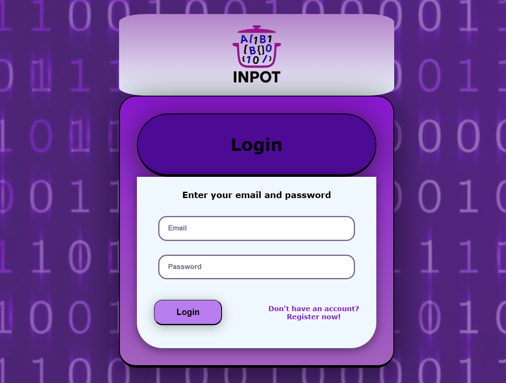
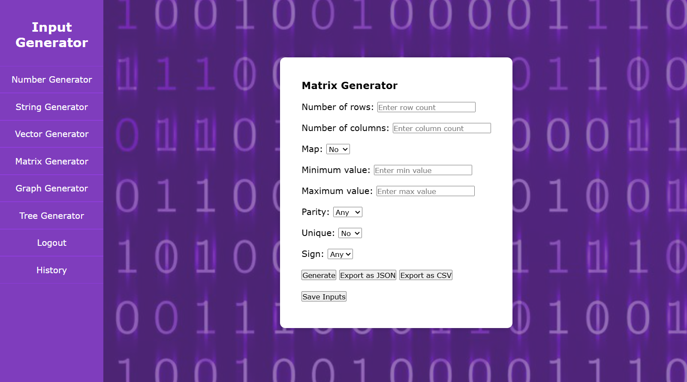
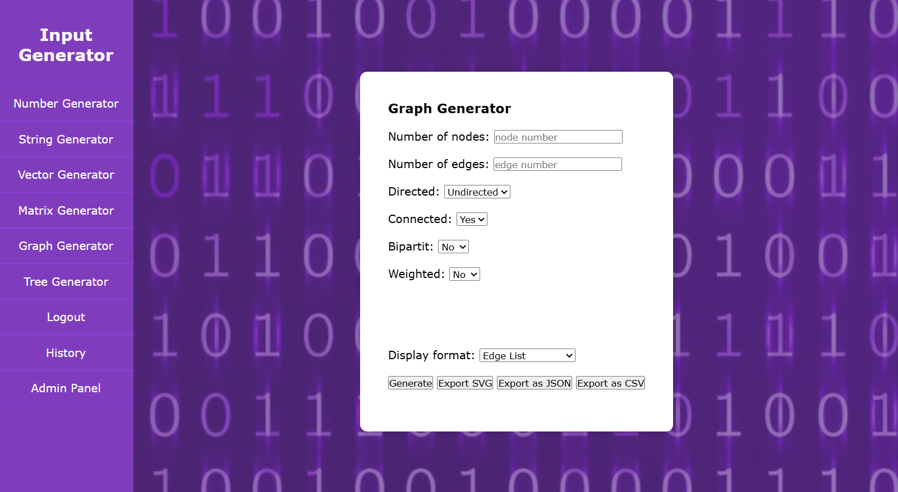

<!--
Hey, thanks for using the awesome-readme-template template.  
If you have any enhancements, then fork this project and create a pull request 
or just open an issue with the label "enhancement".

Don't forget to give this project a star for additional support ;)
Maybe you can mention me or this repo in the acknowledgements too
-->
<div align="center">

  
  <h1>Awesome Readme Template</h1>
  
  <p>
    An awesome README template for your projects! 
  </p>
  
  
<!-- Badges -->
<p>
  <a href="https://github.com/Louis3797/awesome-readme-template/graphs/contributors">
    
  </a>
  <a href="">
    
  </a>
  <a href="https://github.com/Louis3797/awesome-readme-template/network/members">
    
  </a>
  <a href="https://github.com/Louis3797/awesome-readme-template/stargazers">
    
  </a>
  <a href="https://github.com/Louis3797/awesome-readme-template/issues/">
    
  </a>
  <a href="https://github.com/Louis3797/awesome-readme-template/blob/master/LICENSE">
    
  </a>
</p>
   
<h4>
    <a href="https://github.com/Louis3797/awesome-readme-template/">View Demo</a>
  <span> · </span>
    <a href="https://github.com/Louis3797/awesome-readme-template">Documentation</a>
  <span> · </span>
    <a href="https://github.com/Louis3797/awesome-readme-template/issues/">Report Bug</a>
  <span> · </span>
    <a href="https://github.com/Louis3797/awesome-readme-template/issues/">Request Feature</a>
  </h4>
</div>

<br />

<!-- Table of Contents -->
# :notebook_with_decorative_cover: Table of Contents

- [About the Project](#star2-about-the-project)
  * [Screenshots](#camera-screenshots)
  * [Tech Stack](#space_invader-tech-stack)
  * [Features](#dart-features)
  * [Color Reference](#art-color-reference)
  * [Environment Variables](#key-environment-variables)
- [Getting Started](#toolbox-getting-started)
  * [Prerequisites](#bangbang-prerequisites)
  * [Run Locally](#running-run-locally)
  * [Deployment](#triangular_flag_on_post-deployment)
- [Usage](#eyes-usage)
- [FAQ](#grey_question-faq)
- [License](#warning-license)
- [Contact](#handshake-contact)


  

<!-- About the Project -->
## :star2: About the Project


<!-- Screenshots -->
### :camera: Screenshots

<div align="center"> 
  
  <br />
  
  <br />
  
</div>


<!-- TechStack -->
### :space_invader: Tech Stack

<details>
  <summary>Client</summary>
<ul>
    <li><a href="https://developer.mozilla.org/docs/Web/HTML">HTML</a></li>
    <li><a href="https://developer.mozilla.org/docs/Web/JavaScript">JavaScript</a></li>
    <li><a href="https://developer.mozilla.org/docs/Web/CSS">CSS</a></li>
  </ul>
</details>

<details>
  <summary>Server</summary>
  <ul>
  <li><a href="https://www.php.net/">PHP</a></li>
  </ul>
</details>

<details>
<summary>Database</summary>
  <ul>
    <li><a href="https://www.postgresql.org/">PostgreSQL</a></li>
  </ul>
</details>

<details>
<summary>DevOps</summary>
  <ul>
  <li><a href="https://github.com/">GitHub</a></li>
  </ul>
</details>


### :dart: Features

- Number Generator ([views/components/number.html](views/components/number.html))
- String Generator ([views/components/string.html](views/components/string.html))
- Vector Generator ([views/components/vector.html](views/components/vector.html))
- Matrix Generator ([views/components/matrix.html](views/components/matrix.html))
- Graph Generator ([views/components/graph.html](views/components/graph.html))
- Tree Generator ([views/components/tree.html](views/components/tree.html))
- History ([views/components/history.html](views/components/history.html))
- Login/Sign In ([views/components/login.html](views/components/login.html))
- Admin ([views/components/admin.html](views/components/admin.html))

<!-- Color Reference -->
### :art: Color Reference

| Color Name         | Hex / CSS Value                        | Usage/Notes                        |
| ------------------ | -------------------------------------- | ---------------------------------- |
| Primary Background | rebeccapurple (#663399)                | Main background (`body`)           |
| Sidebar            | rgb(127, 61, 189)                      | Sidebar background                 |
| Sidebar Hover      | #e910ba                                | Sidebar item hover                 |
| Container BG       | white (#ffffff)                        | Main content containers            |
| Login Bar          | rgb(77, 10, 148)                       | Login bar                          |
| Container Gradient | linear-gradient(rgb(137,23,208), rgb(162,97,190)) | Container background gradient      |
| Accent             | rgb(184, 125, 239)                     | Login button, highlights           |
| Text               | black (#000000)                        | Main text                          |
| Table Header       | #f2f2f2                                | History table header              


<!-- Getting Started -->
## 	:toolbox: Getting Started

<!-- Prerequisites -->
### :bangbang: Prerequisites

This project uses Yarn as package manager

```bash
 npm install --global yarn
```


<!-- Run Locally -->
### :running: Run Locally

Clone the project

```bash
  git clone https://github.com/alexaaldea/Web2025.git
```


<!-- Deployment -->
### :triangular_flag_on_post: Deployment


<!-- Usage -->
## :eyes: Usage

Inpot is an input generator web application designed to help users quickly create and manage various types of data for testing and educational purposes. The project features a user-friendly interface for generating numbers, strings, vectors, matrices, graphs, and trees, making it ideal for students, developers, and educators who need sample data for algorithms, programming exercises, or system testing.

Key features include:
- Multiple generator modules (number, string, vector, matrix, graph, tree)
- History tracking for generated inputs
- User authentication and admin management
- Clean, modern UI with responsive design

Explore the screenshots above to see the main user and admin interfaces. For more details, check out the code samples in the `/views/components/` directory or try the live demo linked at the top of this README.


<!-- FAQ -->
## :grey_question: FAQ

- **What is Inpot?**

  + Inpot is a web application for generating various types of input data (numbers, strings, vectors, matrices, graphs, trees) for testing, learning, or development purposes.

- **Who can use Inpot?**

  + Inpot is designed for students, educators, developers, and anyone who needs sample data for algorithms, programming exercises, or system testing.


- **What technologies does Inpot use?**

  + Inpot is built with HTML, CSS, JavaScript (client-side), PHP (server-side), and PostgreSQL (database).

- **Can I contribute to Inpot?**

  + Yes! Contributions are welcome. Please see the `contributing.md` file for guidelines.

- **Where can I report bugs or request features?**

  + You can open an issue on the [GitHub Issues page](https://github.com/alexaaldea/Web2025/issues).

- **Is there a live demo available?**

  + Yes, see the "View Demo" link at the top of this README for a live version.


<!-- License -->
## :warning: License

Distributed under the no License. See LICENSE.txt for more information.


<!-- Contact -->
## :handshake: Contact
Aldea Alexandra Maria - -
Cotea Carla Gabriela - coteacarla@gmail.com


